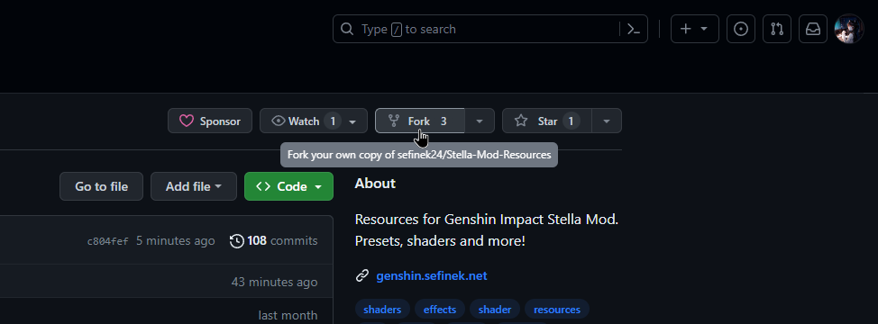
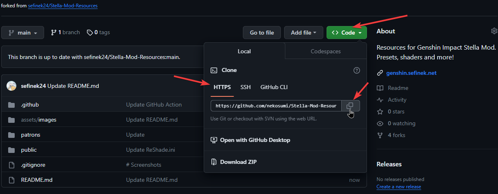
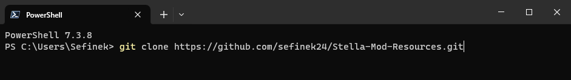
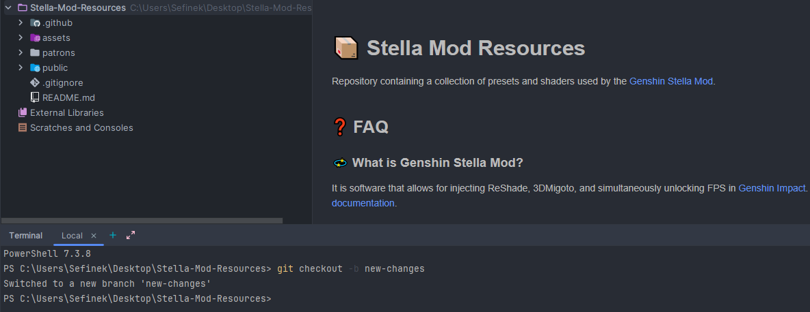
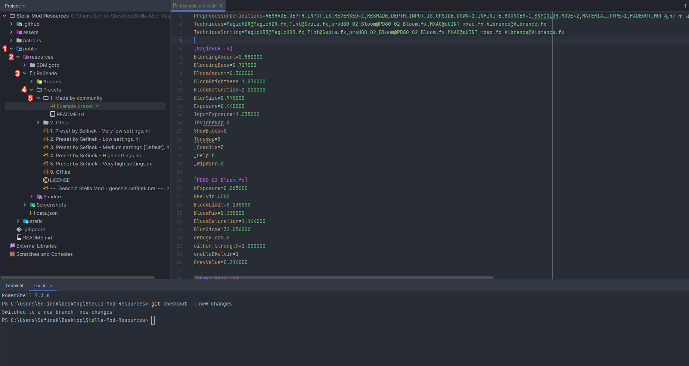

# 📦 Stella Mod Resources
Repository containing a collection of presets and shaders used by the [Genshin Stella Mod](https://sefinek.net/genshin-impact-reshade/repositories).


## 🔎 File locations
1. **ReShade**
    - **Addons:** [public/resources/ReShade/Addons](/public/resources/ReShade/Addons)
    - **Presets:** [public/resources/ReShade/Presets](/public/resources/ReShade/Presets)
      - **Made by community:** [public/resources/ReShade/Presets/1.%20Made%20by%20community](/public/resources/ReShade/Presets/1.%20Made%20by%20community)
      - **Other:** [public/resources/ReShade/Presets/2.%20Other](/public/resources/ReShade/Presets/2.%20Other)
    - **Shaders:** [public/resources/ReShade/Shaders](/public/resources/ReShade/Shaders)
      - **Effects:** [public/resources/ReShade/Shaders/Effects](/public/resources/ReShade/Shaders/Effects)
      - **Textures:** [public/resources/ReShade/Shaders/Textures](/public/resources/ReShade/Shaders/Textures)
2. **Screenshots:** [public/resources/Screenshots](/public/resources/Screenshots)


## ❓ FAQ

### 💫 What is Genshin Stella Mod?
It is software that allows for injecting ReShade, 3DMigoto, and simultaneously unlocking FPS in [Genshin Impact](https://genshin.hoyoverse.com).
The Chinese version [YuanShen](https://www.yuanshen.com) is also supported.
More information is available in the [official documentation](https://sefinek.net/genshin-impact-reshade/docs?page=introduction).

### 📂 I'm using Genshin Stella Mod. Where are the resources located on my computer?
Resources are by default downloaded and updated in the `C:\Stella-Mod-Resources` directory. Users have the option to change the folder. It is recommended that resources be present on a faster SSD drive.


## 👥 Collaboration
If you'd like to contribute your preset to the application's public resources, please create a new [Pull request](https://github.com/sefinek24/Stella-Mod-Resources/pulls).
Your contributions are greatly appreciated.

### 🍽️ How to create a new Pull request

1. **Fork the Repository**
    - Click the "Fork" button on the top-right of the repository's page. This creates a copy of the repository in your GitHub account.
      

2. **Clone Your Forked Repository**
    - In **your forked repository**, click the "Code" button and copy the repository's URL.
      

    - Open your terminal or cmd and use the `git clone` command to download your forked repository to your local machine.
      > [!IMPORTANT]  
      > To execute this command, you need to have [Git](https://git-scm.com/downloads) installed. Please ensure that you have it installed.

        ```bash
        git clone <COPIED-URL>
        ```
      

3. **Create a New Branch**
    - Use the `git checkout` command to create and switch to a new branch for your changes:
        ```bash
        git checkout -b new-changes
        ```
      

4. **Make Your Changes**
    - Make the necessary changes to the project in your local repository.
      

      > [!WARNING]  
      > PLEASE MAKE SURE YOU'RE CREATING THE PRESET IN THE CORRECT PATH!
      > ADDITIONALLY, FILES MUST FOLLOW THE APPROPRIATE NAMING CONVENTIONS!
      > IT IS ESSENTIAL TO FAMILIARIZE YOURSELF WITH THE RULES AVAILABLE [HERE](https://github.com/sefinek24/Stella-Mod-Resources/tree/main/public/resources/ReShade/Presets/1.%20Made%20by%20community).  
      > FAILURE TO COMPLY WILL RESULT IN YOUR PULL REQUEST BEING REJECTED!

5. **Commit Your Changes**
    - Use the `git commit` command to commit your changes locally:
        ```bash
        git commit -m "Your descriptive commit message"
        ```
      Output:
        ```cmd
        - PS C:\Users\Sefinek\Desktop\Stella-Mod-Resources> git commit -m "New preset made by Nekosumi"
         [new-changes afb0b5b] New preset made by Nekosumi
         6 files changed, 51 insertions(+), 476 deletions(-)
         create mode 100644 public/resources/ReShade/Presets/1. Made by community/Example preset.ini
        ```

6. **Push Changes to Your Fork**
    - Push your branch to your fork on GitHub using the `git push` command:
        ```bash
        git add .
        git push origin new-changes
        ```

7. **Create a Pull Request**
    - Go to the original repository on GitHub.
    - Click on the "Pull Request" tab.
    - Click the "New Pull Request" button.
    - Select your branch in the "base" and "compare" dropdowns.
    - Add a title and description for your pull request.
    - Click "Create Pull Request".

8. **Review and Merge**
    - The repository owner or maintainers will review your pull request.
    - If your changes are approved, your pull request will be merged into the original repository.

That's it! You've successfully created a pull request on GitHub. Your changes are now part of the project. Thank you.


## 💙 Attribution
In this repository, we have utilized shaders from the [crosire/reshade-shaders](https://github.com/crosire/reshade-shaders/tree/slim) and other sources.


## 📑 License
This repository is published under the [MIT License](LICENSE). For detailed information about the terms and conditions, please refer to the [LICENSE](LICENSE) file included in the repository.

As for the shaders, each shader is distributed under its own specific license. Please review the individual licenses provided with each shader for more details on their respective terms and conditions.